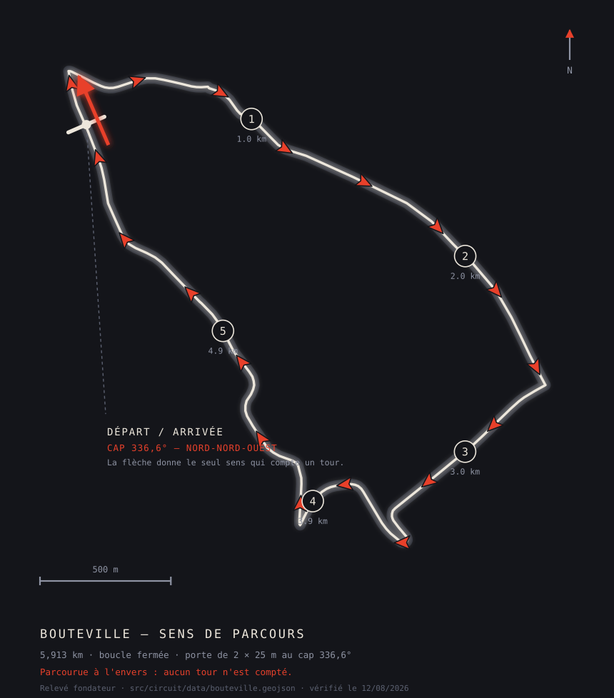

# Bouteville — premier essai terrain

*Séance du **13/08/2026 à 00h20** (fin 06h00). À lire avant de partir, pas au retour.*

---

## Le seul point qui ne se rattrape pas : le sens



*Le schéma ci-dessus est généré depuis la géométrie du dépôt par
`scripts/genererSchemaSensCircuit.js` : chaque flèche est posée sur un point
calculé du tracé et orientée par sa tangente. La grande flèche de la ligne
coïncide à 0,02° avec le cap enregistré en base. Rien n'y est dessiné à vue.*

La ligne d'arrivée est une **porte orientée**. Franchie à l'envers, elle ne compte
rien — pas un tour approximatif, pas un tour douteux : **zéro**. Vérifié en
rejouant le tracé à l'envers dans l'algorithme réel.

Le sens enregistré est celui du relevé :

> depuis la ligne, la piste part **au nord-nord-ouest** (cap 336,6°) vers la
> pointe nord de la boucle, puis file plein est, redescend au sud-est, et
> remonte par l'ouest jusqu'à la ligne.

Les repères numérotés donnent l'ordre : **1** à 1,0 km après la ligne, **2** à
2,0 km, **3** à 3,0 km, **4** à 3,9 km, **5** à 4,9 km. La ligne se trouve à
31,6 % du tracé — vous roulez 4 046 m après elle pour boucler.

**Une nuance de nuit.** La séance est à 00h20 : vous n'aurez pas de repère
visuel lointain pour vous situer. Le premier virage après la ligne est la pointe
nord, à environ 400 m — c'est le point le plus resserré du parcours.

Si vous tournez dans l'autre sens, la séance sera enregistrée — trames, vitesses,
accélérations, tout — mais **sans aucun tour chronométré**. Le bilan sera muet
sur le chrono.

C'est le seul élément de ce dossier qui décide de la journée avant même de
démarrer.

---

## Un pas à faire une fois, sur `gabinfillat@gmail.com`

Ce compte était en rôle *partenaire* depuis juillet. Il est repassé **pilote** :
en partenaire, l'application le renvoyait vers son espace et il n'atteignait
jamais l'écran de capture.

Il lui reste **le Pacte de Pilotage à signer** — il ne l'a jamais fait. L'app le
proposera au premier lancement, une fois, et vous n'y reviendrez plus.

**Je ne l'ai pas signé à votre place.** Un pacte accepté par un tiers ne vaut
rien, et ce n'est pas à moi de cocher une case qui vous engage.

`administration@oxvehicle.fr` n'a rien à faire : il est admin, il arrive
directement dans l'arbre pilote.

Pour revenir en partenaire plus tard :

```bash
psql "$SUPABASE_DB_URL" -c "update public.users set role='partner' where id='88203298-6204-45d9-b6e6-e8d9aa6c0c3a';"
```

---

## Ce qui a été vérifié, et comment

Un tracé ne se vérifie pas en le regardant. La polyligne a été densifiée à un pas
de 2 m — ce que rend un RaceBox à 25 Hz — et passée dans l'algorithme réel de
détection de tours.

| Ce qu'on cherchait | Résultat |
|---|---|
| La boucle se referme | 0,00 m d'écart, 140 sommets |
| Longueur | 5 913 m |
| Le tracé se croise-t-il ? | Aucune auto-intersection |
| Ligne d'arrivée sur la piste | 4,38 m — la porte est coupée |
| Cap au franchissement | 336,6° (339,4° sur base large : la piste ne tourne pas là) |
| Un autre brin peut-il déclencher la porte ? | Le plus proche est à 157,6 m |
| Séance de 33 min simulée | **8 franchissements sur 8** |
| … avec 3 m de bruit GPS | 8 sur 8 |
| … à 10 Hz, puis à 5 Hz | 8 sur 8 |
| Parcourue à l'envers | 0 — comme prévu |

La demi-largeur de porte est réglée à **25 m** : très au-dessus des 4,38 m de
décalage, très en dessous des 157 m qui feraient courir un risque de confusion.

**La ligne n'a pas été déplacée.** Sa projection exacte sur la piste donnerait
0 m au lieu de 4,38 — elle a été essayée, les deux comptent 3 tours sur 3.
Déplacer en silence un repère relevé sur le terrain pour gagner quatre mètres qui
ne changent rien n'était pas la bonne façon de faire.

---

## Ce que la vérification a trouvé, et qui n'était pas dans le tracé

La même simulation a sorti autre chose, et c'est plus important que le reste.

**Un véhicule à l'arrêt sur la ligne comptait des tours.** Le GPS d'une voiture
immobile dérive de quelques mètres en permanence ; chaque oscillation qui
traversait la porte dans le bon sens comptait un tour. Cinq minutes d'arrêt :
**trente tours**, un toutes les dix secondes — la cadence exacte du garde-fou
anti-double-comptage.

Ce n'est pas cosmétique. Un tour de dix secondes devient le **meilleur tour** de
la séance, et tout le bilan se lit ensuite par rapport à lui. Sur une boucle de
5,9 km, c'est une donnée fabriquée en plein milieu de l'écran central du produit.

C'est corrigé : il faut désormais avoir **réellement parcouru** au moins la
moitié du circuit entre deux tours. La distance se mesure sur la vitesse du
boîtier, pas sur les positions — une première version cumulait les positions et
ne servait à rien, la dérive du GPS étant elle-même une distance (vingt
kilomètres en cinq minutes d'immobilité).

Treize tests, tous sur la géométrie réelle de Bouteville, tous en exécution.

---

## Ce que le hors-ligne change, et ce qu'il ne change pas

Bouteville est en rase campagne. Deux choses à savoir.

**La capture ne dépend pas du réseau.** Elle démarre localement, écrit un `.ubx`
sur le téléphone, et met la synchronisation en file d'attente. Une coupure de
liaison Bluetooth met la séance en pause et la reprend ; seule une interruption
continue de quinze minutes la clôt.

**Mais le circuit doit avoir été chargé au moins une fois.** L'écran de placement
relit maintenant la liste de force — sans quoi le cache de 24 h aurait pu masquer
Bouteville le jour même. Si la lecture échoue, il retombe sur le cache ; et un
téléphone qui n'a **jamais** vu Bouteville n'a rien à retomber dessus.

> **Ouvrez l'écran de placement une fois avec du réseau** — chez vous, en
> arrivant, n'importe quand avant de rouler. Vérifiez que « Bouteville » apparaît
> dans la rangée de circuits. Ce seul geste met le tracé en cache pour la journée.

---

## La journée en base

La séance est posée au **13/08/2026, de 00h20 à 06h00**, non privée, rattachée
au circuit Bouteville, avec une inscription confirmée pour chacun des deux
comptes.

Elle sert à l'affichage — Paddock, Pass, QR d'entrée. **La capture n'en dépend
pas** : vous pouvez armer même si la date ne correspond pas.

Pour déplacer l'horaire :

```bash
psql "$SUPABASE_DB_URL" -c "update public.sessions set date='2026-08-13', start_time='00:20', end_time='06:00' where id='0d14df02-bb5c-45b9-beda-4d87d07f49fd';"
```

---

## Ce que la séance a rendu, et ce qu'elle a révélé

La détection a tenu. Trois tours, mesurés par deux méthodes indépendantes qui
concordent à **1,4 m près** :

| Tour | Durée | Odomètre (trame à trame) | Vitesse moyenne × durée |
|---|---|---|---|
| 1 | 6:00,5 | 5 875,5 m | 5 876,9 m |
| 2 | **5:27,5** | 5 873,7 m | 5 873,0 m |
| 3 | 5:39,5 | 5 874,7 m | 5 874,0 m |

Quatre mètres séparent les trois tours, sur une boucle relevée à 5 913 m. C'est
le meilleur contrôle qu'on pouvait espérer du chronométrage.

**Et c'est ce qui a mis un défaut au jour.** `laps.distance_meters` n'a jamais
été écrite — documenté depuis le 26/07, jamais corrigé. Or `etatSeanceService`
la lit pour décider quels tours sont *comparables*, et `compteToursComparables`
n'accepte que des longueurs strictement positives. Le compte valait donc
toujours zéro, et le niveau « Le delta et la trace » ne pouvait s'ouvrir **sur
aucune séance, jamais**.

Ce que vous avez lu après avoir bouclé ces trois tours :

> « Aucun tour comparable. Cette lecture en demande deux qui couvrent la même
> distance. »

Une phrase fausse sur vos propres données. L'odomètre connaissait la longueur du
tour à la trame près, et la remettait à zéro une ligne avant que quiconque ne la
lise.

C'est corrigé à la source : la longueur est figée au franchissement, portée
jusqu'à la base, et un test l'éprouve **jusqu'à l'état du niveau** — pas jusqu'au
champ. Un zéro reste `null` : un odomètre muet ne mesure pas zéro mètre, il ne
mesure rien.

Vos trois tours du 13/08, eux, gardent leur longueur vide : le correctif vaut
pour les séances à venir. Pour les renseigner depuis vos propres trames :

```bash
psql "$SUPABASE_DB_URL" -f scripts/sql/backfill_laps_distance.sql
```

---

## Au retour

Ce qu'il faut regarder, dans cet ordre :

1. **Le nombre de tours** correspond-il à ce que vous avez roulé ? S'il est
   nettement supérieur, dites-le — c'est que la garde de distance laisse encore
   passer quelque chose. S'il est inférieur, c'est un franchissement manqué, et
   la trace `.ubx` permettra de savoir lequel.
2. **Le meilleur tour** est-il plausible ? Un temps très court est le symptôme
   qu'on vient de corriger.
3. **Le tracé** s'affiche-t-il sur le bilan, et est-ce bien Bouteville ?
4. Si vous avez coupé le réseau pendant un direct coach : le flux a-t-il tenu ?
   C'est la seule vérification du relais live qui ne peut pas se faire au bureau.

---

## Ce que ce tracé est

Une boucle de routes ouvertes — le relevé le dit lui-même : D152, Rue du Prévôt,
Echauguette, Châteauneuf, D699. Ce n'est pas un circuit fermé, et l'application
ne fait ici qu'enregistrer ce qui se passe.

La doctrine du silence en piste s'applique inchangée : aucun écran, aucun son,
aucun affichage pendant que le véhicule roule.
